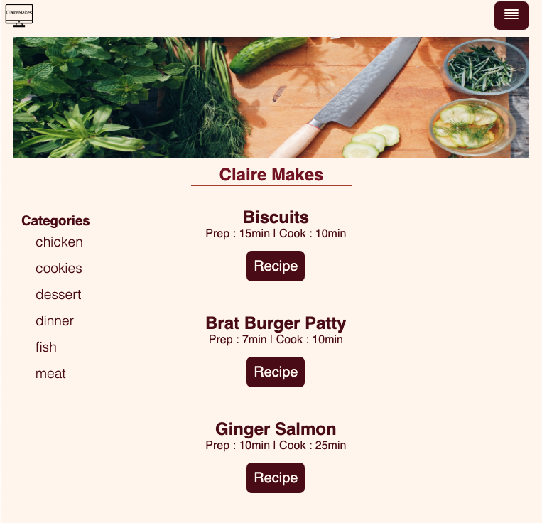

# My Recipes
A recipe site that houses my favorite recipes that I make again and again. The live site- [My Favorite Recipes](https://claire-fav-recipes.netlify.app/)

## Table of Contents
[Introduction](#Introduction)

[Motivation](#Motivation)

[Screenshot](#Screenshot)

[Built With](#built-with)

[License](#License)

[Acknowledgements](#Acknowledgements)

## Introduction
Welcome to my recipe site. I began this site using the Gatsby starter [Hello Word](https://www.gatsbyjs.com/starters/gatsbyjs/gatsby-starter-hello-world/). I found design inspiration in the cookbook The Joy of Cooking. The design focuses on the information in the recipe resulting in a simple and clean design without any fluff. 

I used the Contentful CMS to manage the content. It allowed me to add new recipes, change old ones, and add in my alternations to each recipe. I included tags for each recipe to make them easy to find based on a category. 

## Motivation
I created this site as a way to easily access recipes I enjoy and keep track of how I changed them. I wanted a simple, clean recipe site with just the information for that recipe. I had previously been storing them as screenshots on my phone and tried to remember the adaptations I made. 

## Screenshot

## Built With
- React
- Gatsby
- HTML
- CSS

## License
[MIT](https://choosealicense.com/licenses/mit/)

## Acknowledgements
Gatsby for providing the starter, and Netlify for hosting the site.
